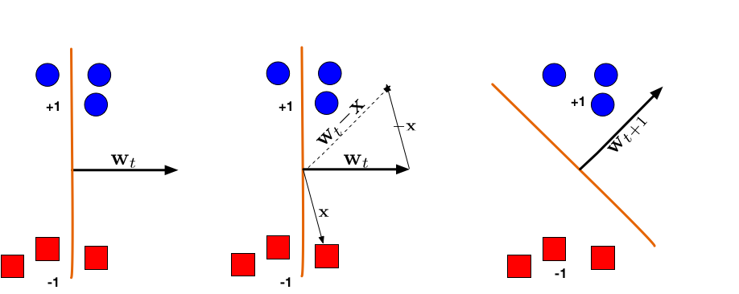

In this project, we will implement a tiny neural network together. Believe it or not, with only a few weeks of learning C++, you can already leverage what you know to venture into the core of modern machine learning!

Nneural networks began as an attempt to model how the brain might process information. In the 1940s, Warren McCulloch and Walter Pitts proposed the first mathematical neuron - an element that outputs a one or a zero depending on whether its inputs cross a threshold. Frank Rosenblatt’s “perceptron” in the 1950s brought that idea into hardware. As shown in the image below, the perceptron is able to learn a linear function that separates the blue circles and red squares from each other!

But its limits soon appeared: it could not learn even a simple logical function like XOR because it could only draw straight decision boundaries. Research slowed until the 1980s, when the rediscovery of backpropagation showed that stacking layers of neurons and adjusting their weights through gradients could learn far richer patterns. That method - propagating error backward to update weights - is still at the heart of modern deep learning, whether in a two-neuron toy model or a billion-parameter transformer.

The XOR problem remains a classic demonstration because it captures the essence of why depth and nonlinearity matter. A single linear transformation cannot separate the ones and zeros of XOR, but two layers with a nonlinear activation can. When you implement a two-two-one network that computes XOR, you are recreating a historical turning point in machine learning: the moment when adding one hidden layer made learning possible.

Going back to C++, machine learning frameworks such as PyTorch or TensorFlow build networks dynamically at runtime, but C++ templates let us express the same structures at compile time. In our TinyTensor project, each matrix or vector is represented by a templated class, for example Tensor<T, Rows, Cols>. The sizes of the tensors become part of their types, so the compiler can check that a multiplication like A * B is dimensionally valid before the program even runs. Errors that would only appear during training in Python become type errors caught instantly by the compiler. Template specialization also lets us generate optimized code for specific shapes - say 3×3 or 4×4 matrices—mirroring how modern ML compilers fuse or unroll operations for efficiency.

With C++20’s constexpr, parts of the network’s computation can actually happen during compilation. A forward pass through a tiny neural net can be evaluated entirely at compile time, turning the compiler itself into a miniature inference engine. This idea echoes what large-scale systems such as XLA or TVM do when they pre-compute constants and fuse kernels: they move work from runtime to compile time to save energy and memory. In this sense, our classroom-sized network is a small-scale version of the same principle driving industrial ML optimization.

Writing a neural network from scratch this way also makes the mathematics tangible. Every line in the code corresponds directly to a step in the equations: dot products in dense(), nonlinearities in relu() and sigmoid(), the loss function measuring prediction error, and gradient descent updating the parameters. You can watch how changing weights alters the decision boundary and how learning rate and initialization affect convergence. Soon enough you'll realize, the “learning” is nothing more than arithmetic, differentiation, and iteration.

When viewed historically, this project connects three eras of computing: the 1950s ambition to mimic neurons, the 1980s insight that backpropagation enables learning, and today’s pursuit of performance through compilation and static analysis. Building a small neural network with C++ templates is not just an exercise in coding; it’s a way to see how ideas about intelligence and computation have evolved—from biology, to mathematics, to high-performance systems that can reason at compile time.

As I was creating this project, I took my liberty to sprinkle some machine learning content in the code in the form of comments - don't worry, if you are not interested in machine learning, you'll get through this lab just fine. However, if you are curious about machine learning and wouldn't build something that you don't fully understand, try to take a look at the comments and they will definitely give you a better idea of the bigger picture.

I understand that implementing math equations could be tedious, so I tried to leave the more fun parts for you to implement. 

As you are implementing the functions, I want you to identify: which functions are run at compile time and which are run at run time?

Stretch goals:

Try to adjust the weight in the initial neural net and see how that changes the final output. Because of the simplicity of our neural net, you can actually trace the layers rather easily.

Try to initialize the neural net with random small weights using the `<random>` library. What are the pros and cons of this approach?