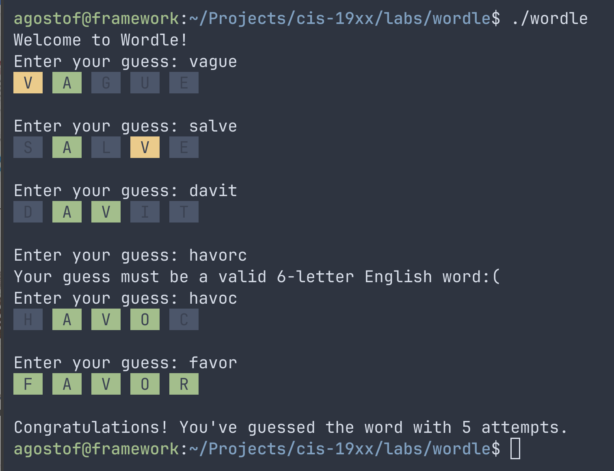

# Wordle

The New York Times newpapers are not selling. As a software developer at NY Times, you are tasked with developing a new digital word game to gain traction for the company. (As a matter of fact, Wordle was acquired by New York Times but we need not worry about that here.)

Your job is to design the Wordle class and implement the game logic. The game loop and some skeleton code are already provided for you. To compile, use the following command:

`clang++ -std=c++17 -Wall -Wextra -pedantic -o wordle wordle.cpp`

`-std=c++17` – Enables modern C++17 features (e.g., [[maybe_unused]], in-class initializers)

`-Wall` – Enables most compiler warnings

`-Wextra` – Adds more detailed warnings for common mistakes

`-pedantic` – Ensures the code follows the C++ standard strictly

These flags help you catch subtle bugs and write cleaner, more portable code.

## Game rules:

The player has 6 attempts to guess a 5-letter English word.

Each guess must be exactly 5 letters long and contain only alphabetic characters.

For each letter in the guess:

🟩 Green — correct letter in the correct position

🟨 Yellow — correct letter, wrong position

⬜ Grey — letter not in the word

After every guess, the game prints colored tiles showing the result.

The game ends when the player either:

Guesses the word correctly (win), or

Runs out of attempts (lose).

## Functional requirements:

Implement the following methods inside the Wordle class:

`Wordle(const std::string& answer, int remaining_attempts = MAX_ATTEMPTS)`

Initializes the game with:

The answer word.

The number of remaining attempts (defaults to MAX_ATTEMPTS).

`bool IsValidGuess(const std::string& guess) const`

Returns true if:

The guess length is exactly WORD_LENGTH.

All characters are alphabetic (isAlpha() helper).

The guess is an English word (isEnglishWord() stubbed as always true).

Returns false otherwise.

`int GetRemainingAttempts() const`

Returns how many guesses the player has left.

`void ReduceRemainingAttempts()`

Decrements the attempt counter by one.

`void EvaluateGuess(const std::string& guess)`

Core logic for comparing the guess with the answer.

Print results with printTile() for each letter.

`bool Won() const`

Returns true if the player guessed the word exactly; otherwise false.

Do not make assumptions about user input. Check for all edge cases.

You do not need to keep track of previous guesses.

## Bonus questions
1. What can I do if I want to check if the answer passed to the Wordle constructor has length equal to WORD_LENGTH and is an English word? What if I want to do that at compile time? 

2. What does the `[[maybe_unsed]]` do in the `isEnglishWord` function? Why could it be useful?

## Notes:
prerequisites:
- primitive types, user defined type
- data memebers and member functions
- protection levels
- encapsulation principles